# Entity Relationship (ER) Diagram
## SoleMate E-Commerce Platform

### Document Information
- **Project Name:** SoleMate E-Commerce Platform
- **Document Version:** 1.0
- **Date:** September 20, 2024
- **Prepared by:** Database Architecture Team
- **Document Type:** Database Design Document

---

## 1. ER Diagram Overview

### 1.1 Diagram Notation
- **Entities:** Represented as rectangles
- **Attributes:** Listed within entities
- **Primary Keys:** Marked with [PK]
- **Foreign Keys:** Marked with [FK]
- **Relationships:** Lines with cardinality notation
  - 1:1 (One to One)
  - 1:N (One to Many)
  - M:N (Many to Many)

---

## 2. Complete ER Diagram

```mermaid
erDiagram
    USERS ||--o{ ADDRESSES : "has"
    USERS ||--o{ ORDERS : "places"
    USERS ||--o{ REVIEWS : "writes"
    USERS ||--o{ CART_ITEMS : "adds"
    USERS ||--o{ WISHLIST_ITEMS : "saves"
    USERS ||--o{ USER_SESSIONS : "creates"
    
    PRODUCTS ||--o{ PRODUCT_VARIANTS : "has"
    PRODUCTS ||--o{ PRODUCT_IMAGES : "has"
    PRODUCTS ||--o{ PRODUCT_ATTRIBUTES : "has"
    PRODUCTS ||--o{ REVIEWS : "receives"
    PRODUCTS ||--o{ CART_ITEMS : "added_to"
    PRODUCTS ||--o{ WISHLIST_ITEMS : "saved_in"
    PRODUCTS ||--o{ ORDER_ITEMS : "ordered_as"
    PRODUCTS }o--|| CATEGORIES : "belongs_to"
    PRODUCTS }o--|| BRANDS : "manufactured_by"
    
    CATEGORIES ||--o{ CATEGORIES : "has_subcategories"
    
    ORDERS ||--o{ ORDER_ITEMS : "contains"
    ORDERS ||--|| PAYMENTS : "paid_through"
    ORDERS ||--o{ ORDER_STATUS_HISTORY : "tracks"
    ORDERS ||--o{ SHIPMENTS : "shipped_via"
    
    PRODUCT_VARIANTS ||--o{ INVENTORY : "tracked_in"
    PRODUCT_VARIANTS ||--o{ CART_ITEMS : "selected_in"
    PRODUCT_VARIANTS ||--o{ ORDER_ITEMS : "purchased_as"
    
    PROMO_CODES ||--o{ ORDERS : "applied_to"
    PROMO_CODES ||--o{ PROMO_USAGE : "tracked_by"

    USERS {
        uuid id PK
        string email UK
        string password_hash
        string first_name
        string last_name
        string phone_number
        enum role
        boolean is_active
        boolean email_verified
        timestamp last_login_at
        timestamp created_at
        timestamp updated_at
    }

    ADDRESSES {
        uuid id PK
        uuid user_id FK
        enum type
        string name
        string street_1
        string street_2
        string city
        string state
        string postal_code
        string country
        string phone
        boolean is_default
        timestamp created_at
    }

    PRODUCTS {
        uuid id PK
        string sku UK
        string name
        string slug UK
        text description
        uuid category_id FK
        uuid brand_id FK
        decimal price
        decimal compare_price
        decimal cost
        decimal weight
        boolean is_active
        string[] tags
        string meta_title
        text meta_description
        timestamp created_at
        timestamp updated_at
    }

    PRODUCT_VARIANTS {
        uuid id PK
        uuid product_id FK
        string sku UK
        string size
        string color
        decimal price
        integer stock
        decimal weight
        string[] images
        boolean is_active
        timestamp created_at
    }

    CATEGORIES {
        uuid id PK
        uuid parent_id FK
        string name
        string slug UK
        text description
        string image_url
        integer sort_order
        boolean is_active
        timestamp created_at
    }

    BRANDS {
        uuid id PK
        string name UK
        string slug UK
        string logo_url
        string website
        text description
        boolean is_active
        timestamp created_at
    }

    ORDERS {
        uuid id PK
        string order_number UK
        uuid user_id FK
        enum status
        decimal subtotal
        decimal discount
        decimal tax
        decimal shipping
        decimal total
        text notes
        json shipping_address
        json billing_address
        uuid payment_id FK
        string tracking_number
        timestamp created_at
        timestamp updated_at
    }

    ORDER_ITEMS {
        uuid id PK
        uuid order_id FK
        uuid product_id FK
        uuid variant_id FK
        string sku
        string name
        integer quantity
        decimal price
        decimal discount
        decimal total
        json product_snapshot
        timestamp created_at
    }

    PAYMENTS {
        uuid id PK
        uuid order_id FK
        uuid user_id FK
        decimal amount
        string currency
        enum status
        enum provider
        string transaction_id
        string payment_method
        text failure_reason
        json metadata
        decimal refund_amount
        timestamp refunded_at
        timestamp created_at
        timestamp updated_at
    }

    REVIEWS {
        uuid id PK
        uuid product_id FK
        uuid user_id FK
        uuid order_id FK
        integer rating
        string title
        text comment
        string[] images
        boolean is_verified
        integer helpful_count
        enum status
        timestamp created_at
        timestamp updated_at
    }

    CART_ITEMS {
        uuid id PK
        uuid user_id FK
        uuid product_id FK
        uuid variant_id FK
        integer quantity
        decimal price
        decimal discount
        timestamp added_at
        timestamp updated_at
    }

    INVENTORY {
        uuid id PK
        uuid product_id FK
        uuid variant_id FK
        uuid warehouse_id FK
        integer quantity
        integer reserved
        integer available
        integer reorder_point
        integer reorder_quantity
        timestamp last_restocked
        timestamp updated_at
    }

    PROMO_CODES {
        uuid id PK
        string code UK
        text description
        enum discount_type
        decimal discount_value
        decimal minimum_order
        integer max_uses
        integer current_uses
        timestamp valid_from
        timestamp valid_until
        boolean is_active
        timestamp created_at
    }
```



---

## 3. Entity Details

### 3.1 Core Entities

#### USERS
**Purpose:** Store customer and admin user information
**Key Relationships:**
- One user can have multiple addresses (1:N)
- One user can place multiple orders (1:N)
- One user can write multiple reviews (1:N)

**Indexes:**
- PRIMARY KEY: id
- UNIQUE: email
- INDEX: phone_number, role, is_active

#### PRODUCTS
**Purpose:** Store product master data
**Key Relationships:**
- One product belongs to one category (N:1)
- One product belongs to one brand (N:1)
- One product can have multiple variants (1:N)
- One product can have multiple images (1:N)

**Indexes:**
- PRIMARY KEY: id
- UNIQUE: sku, slug
- INDEX: category_id, brand_id, price, is_active
- FULLTEXT: name, description, tags

#### ORDERS
**Purpose:** Store customer orders
**Key Relationships:**
- One order belongs to one user (N:1)
- One order contains multiple items (1:N)
- One order has one payment (1:1)

**Indexes:**
- PRIMARY KEY: id
- UNIQUE: order_number
- INDEX: user_id, status, created_at

### 3.2 Junction Tables

#### ORDER_ITEMS
**Purpose:** Many-to-many relationship between orders and products
**Composite Key:** (order_id, product_id, variant_id)

#### CART_ITEMS
**Purpose:** Temporary storage of user's shopping cart
**Composite Key:** (user_id, product_id, variant_id)

#### WISHLIST_ITEMS
**Purpose:** Products saved for later by users
**Composite Key:** (user_id, product_id)

---

## 4. Relationship Cardinalities

### 4.1 One-to-One (1:1)
- ORDER ↔ PAYMENT
- USER ↔ USER_PROFILE (if extended)

### 4.2 One-to-Many (1:N)
- USER → ADDRESSES
- USER → ORDERS
- USER → REVIEWS
- PRODUCT → PRODUCT_VARIANTS
- PRODUCT → PRODUCT_IMAGES
- CATEGORY → PRODUCTS
- BRAND → PRODUCTS
- ORDER → ORDER_ITEMS
- ORDER → ORDER_STATUS_HISTORY

### 4.3 Many-to-Many (M:N)
- USERS ↔ PRODUCTS (through CART_ITEMS)
- USERS ↔ PRODUCTS (through WISHLIST_ITEMS)
- ORDERS ↔ PRODUCTS (through ORDER_ITEMS)
- PROMO_CODES ↔ ORDERS (through PROMO_USAGE)

---

## 5. Database Schema SQL

### 5.1 Users and Authentication

```sql
-- Users table
CREATE TABLE users (
    id UUID PRIMARY KEY DEFAULT gen_random_uuid(),
    email VARCHAR(255) UNIQUE NOT NULL,
    password_hash VARCHAR(255) NOT NULL,
    first_name VARCHAR(100),
    last_name VARCHAR(100),
    phone_number VARCHAR(20),
    role VARCHAR(20) DEFAULT 'customer' CHECK (role IN ('customer', 'admin', 'manager')),
    is_active BOOLEAN DEFAULT true,
    email_verified BOOLEAN DEFAULT false,
    last_login_at TIMESTAMP,
    created_at TIMESTAMP DEFAULT CURRENT_TIMESTAMP,
    updated_at TIMESTAMP DEFAULT CURRENT_TIMESTAMP
);

CREATE INDEX idx_users_email ON users(email);
CREATE INDEX idx_users_phone ON users(phone_number);
CREATE INDEX idx_users_role ON users(role);

-- Addresses table
CREATE TABLE addresses (
    id UUID PRIMARY KEY DEFAULT gen_random_uuid(),
    user_id UUID NOT NULL REFERENCES users(id) ON DELETE CASCADE,
    type VARCHAR(20) DEFAULT 'shipping' CHECK (type IN ('shipping', 'billing')),
    name VARCHAR(100) NOT NULL,
    street_1 VARCHAR(255) NOT NULL,
    street_2 VARCHAR(255),
    city VARCHAR(100) NOT NULL,
    state VARCHAR(100) NOT NULL,
    postal_code VARCHAR(20) NOT NULL,
    country VARCHAR(2) NOT NULL,
    phone VARCHAR(20),
    is_default BOOLEAN DEFAULT false,
    created_at TIMESTAMP DEFAULT CURRENT_TIMESTAMP
);

CREATE INDEX idx_addresses_user_id ON addresses(user_id);
```

### 5.2 Product Catalog

```sql
-- Categories table (self-referential for hierarchy)
CREATE TABLE categories (
    id UUID PRIMARY KEY DEFAULT gen_random_uuid(),
    parent_id UUID REFERENCES categories(id) ON DELETE CASCADE,
    name VARCHAR(100) NOT NULL,
    slug VARCHAR(100) UNIQUE NOT NULL,
    description TEXT,
    image_url VARCHAR(500),
    sort_order INTEGER DEFAULT 0,
    is_active BOOLEAN DEFAULT true,
    created_at TIMESTAMP DEFAULT CURRENT_TIMESTAMP
);

CREATE INDEX idx_categories_parent_id ON categories(parent_id);
CREATE INDEX idx_categories_slug ON categories(slug);

-- Brands table
CREATE TABLE brands (
    id UUID PRIMARY KEY DEFAULT gen_random_uuid(),
    name VARCHAR(100) UNIQUE NOT NULL,
    slug VARCHAR(100) UNIQUE NOT NULL,
    logo_url VARCHAR(500),
    website VARCHAR(255),
    description TEXT,
    is_active BOOLEAN DEFAULT true,
    created_at TIMESTAMP DEFAULT CURRENT_TIMESTAMP
);

CREATE INDEX idx_brands_slug ON brands(slug);

-- Products table
CREATE TABLE products (
    id UUID PRIMARY KEY DEFAULT gen_random_uuid(),
    sku VARCHAR(100) UNIQUE NOT NULL,
    name VARCHAR(255) NOT NULL,
    slug VARCHAR(255) UNIQUE NOT NULL,
    description TEXT,
    category_id UUID REFERENCES categories(id),
    brand_id UUID REFERENCES brands(id),
    price DECIMAL(10, 2) NOT NULL CHECK (price >= 0),
    compare_price DECIMAL(10, 2) CHECK (compare_price >= 0),
    cost DECIMAL(10, 2) CHECK (cost >= 0),
    weight DECIMAL(10, 3),
    is_active BOOLEAN DEFAULT true,
    tags TEXT[],
    meta_title VARCHAR(255),
    meta_description TEXT,
    created_at TIMESTAMP DEFAULT CURRENT_TIMESTAMP,
    updated_at TIMESTAMP DEFAULT CURRENT_TIMESTAMP
);

CREATE INDEX idx_products_sku ON products(sku);
CREATE INDEX idx_products_slug ON products(slug);
CREATE INDEX idx_products_category_id ON products(category_id);
CREATE INDEX idx_products_brand_id ON products(brand_id);
CREATE INDEX idx_products_price ON products(price);
CREATE INDEX idx_products_is_active ON products(is_active);
CREATE INDEX idx_products_tags ON products USING GIN(tags);

-- Product variants table
CREATE TABLE product_variants (
    id UUID PRIMARY KEY DEFAULT gen_random_uuid(),
    product_id UUID NOT NULL REFERENCES products(id) ON DELETE CASCADE,
    sku VARCHAR(100) UNIQUE NOT NULL,
    size VARCHAR(20),
    color VARCHAR(50),
    price DECIMAL(10, 2),
    stock INTEGER DEFAULT 0 CHECK (stock >= 0),
    weight DECIMAL(10, 3),
    images TEXT[],
    is_active BOOLEAN DEFAULT true,
    created_at TIMESTAMP DEFAULT CURRENT_TIMESTAMP,
    UNIQUE(product_id, size, color)
);

CREATE INDEX idx_variants_product_id ON product_variants(product_id);
CREATE INDEX idx_variants_sku ON product_variants(sku);

-- Product images table
CREATE TABLE product_images (
    id UUID PRIMARY KEY DEFAULT gen_random_uuid(),
    product_id UUID NOT NULL REFERENCES products(id) ON DELETE CASCADE,
    url VARCHAR(500) NOT NULL,
    alt_text VARCHAR(255),
    sort_order INTEGER DEFAULT 0,
    is_primary BOOLEAN DEFAULT false,
    created_at TIMESTAMP DEFAULT CURRENT_TIMESTAMP
);

CREATE INDEX idx_product_images_product_id ON product_images(product_id);
```

### 5.3 Orders and Transactions

```sql
-- Orders table
CREATE TABLE orders (
    id UUID PRIMARY KEY DEFAULT gen_random_uuid(),
    order_number VARCHAR(50) UNIQUE NOT NULL,
    user_id UUID NOT NULL REFERENCES users(id),
    status VARCHAR(20) NOT NULL DEFAULT 'PENDING',
    subtotal DECIMAL(10, 2) NOT NULL,
    discount DECIMAL(10, 2) DEFAULT 0,
    tax DECIMAL(10, 2) DEFAULT 0,
    shipping DECIMAL(10, 2) DEFAULT 0,
    total DECIMAL(10, 2) NOT NULL,
    notes TEXT,
    shipping_address JSONB NOT NULL,
    billing_address JSONB NOT NULL,
    promo_code_id UUID REFERENCES promo_codes(id),
    tracking_number VARCHAR(100),
    created_at TIMESTAMP DEFAULT CURRENT_TIMESTAMP,
    updated_at TIMESTAMP DEFAULT CURRENT_TIMESTAMP,
    CONSTRAINT check_order_status CHECK (status IN ('PENDING', 'CONFIRMED', 'PROCESSING', 'SHIPPED', 'DELIVERED', 'CANCELLED', 'RETURNED', 'REFUNDED'))
);

CREATE INDEX idx_orders_user_id ON orders(user_id);
CREATE INDEX idx_orders_status ON orders(status);
CREATE INDEX idx_orders_created_at ON orders(created_at);

-- Order items table
CREATE TABLE order_items (
    id UUID PRIMARY KEY DEFAULT gen_random_uuid(),
    order_id UUID NOT NULL REFERENCES orders(id) ON DELETE CASCADE,
    product_id UUID NOT NULL REFERENCES products(id),
    variant_id UUID REFERENCES product_variants(id),
    sku VARCHAR(100) NOT NULL,
    name VARCHAR(255) NOT NULL,
    quantity INTEGER NOT NULL CHECK (quantity > 0),
    price DECIMAL(10, 2) NOT NULL,
    discount DECIMAL(10, 2) DEFAULT 0,
    total DECIMAL(10, 2) NOT NULL,
    product_snapshot JSONB,
    created_at TIMESTAMP DEFAULT CURRENT_TIMESTAMP
);

CREATE INDEX idx_order_items_order_id ON order_items(order_id);
CREATE INDEX idx_order_items_product_id ON order_items(product_id);

-- Payments table
CREATE TABLE payments (
    id UUID PRIMARY KEY DEFAULT gen_random_uuid(),
    order_id UUID UNIQUE NOT NULL REFERENCES orders(id),
    user_id UUID NOT NULL REFERENCES users(id),
    amount DECIMAL(10, 2) NOT NULL,
    currency VARCHAR(3) DEFAULT 'USD',
    status VARCHAR(20) NOT NULL,
    provider VARCHAR(20) NOT NULL,
    transaction_id VARCHAR(255) UNIQUE,
    payment_method VARCHAR(50),
    failure_reason TEXT,
    metadata JSONB,
    refund_amount DECIMAL(10, 2) DEFAULT 0,
    refunded_at TIMESTAMP,
    created_at TIMESTAMP DEFAULT CURRENT_TIMESTAMP,
    updated_at TIMESTAMP DEFAULT CURRENT_TIMESTAMP,
    CONSTRAINT check_payment_status CHECK (status IN ('PENDING', 'PROCESSING', 'COMPLETED', 'FAILED', 'REFUNDED', 'PARTIAL_REFUND'))
);

CREATE INDEX idx_payments_order_id ON payments(order_id);
CREATE INDEX idx_payments_user_id ON payments(user_id);
CREATE INDEX idx_payments_status ON payments(status);
CREATE INDEX idx_payments_transaction_id ON payments(transaction_id);
```

### 5.4 Reviews and Ratings

```sql
-- Reviews table
CREATE TABLE reviews (
    id UUID PRIMARY KEY DEFAULT gen_random_uuid(),
    product_id UUID NOT NULL REFERENCES products(id) ON DELETE CASCADE,
    user_id UUID NOT NULL REFERENCES users(id),
    order_id UUID REFERENCES orders(id),
    rating INTEGER NOT NULL CHECK (rating >= 1 AND rating <= 5),
    title VARCHAR(255),
    comment TEXT,
    images TEXT[],
    is_verified BOOLEAN DEFAULT false,
    helpful_count INTEGER DEFAULT 0,
    status VARCHAR(20) DEFAULT 'PENDING',
    created_at TIMESTAMP DEFAULT CURRENT_TIMESTAMP,
    updated_at TIMESTAMP DEFAULT CURRENT_TIMESTAMP,
    CONSTRAINT check_review_status CHECK (status IN ('PENDING', 'APPROVED', 'REJECTED')),
    UNIQUE(product_id, user_id, order_id)
);

CREATE INDEX idx_reviews_product_id ON reviews(product_id);
CREATE INDEX idx_reviews_user_id ON reviews(user_id);
CREATE INDEX idx_reviews_rating ON reviews(rating);
CREATE INDEX idx_reviews_status ON reviews(status);
```

### 5.5 Shopping Cart and Wishlist

```sql
-- Cart items table (stored in Redis for performance, this is backup)
CREATE TABLE cart_items (
    id UUID PRIMARY KEY DEFAULT gen_random_uuid(),
    user_id UUID NOT NULL REFERENCES users(id) ON DELETE CASCADE,
    product_id UUID NOT NULL REFERENCES products(id),
    variant_id UUID REFERENCES product_variants(id),
    quantity INTEGER NOT NULL CHECK (quantity > 0),
    price DECIMAL(10, 2) NOT NULL,
    discount DECIMAL(10, 2) DEFAULT 0,
    added_at TIMESTAMP DEFAULT CURRENT_TIMESTAMP,
    updated_at TIMESTAMP DEFAULT CURRENT_TIMESTAMP,
    UNIQUE(user_id, product_id, variant_id)
);

CREATE INDEX idx_cart_items_user_id ON cart_items(user_id);

-- Wishlist items table
CREATE TABLE wishlist_items (
    id UUID PRIMARY KEY DEFAULT gen_random_uuid(),
    user_id UUID NOT NULL REFERENCES users(id) ON DELETE CASCADE,
    product_id UUID NOT NULL REFERENCES products(id) ON DELETE CASCADE,
    added_at TIMESTAMP DEFAULT CURRENT_TIMESTAMP,
    UNIQUE(user_id, product_id)
);

CREATE INDEX idx_wishlist_user_id ON wishlist_items(user_id);
```

### 5.6 Inventory Management

```sql
-- Inventory table
CREATE TABLE inventory (
    id UUID PRIMARY KEY DEFAULT gen_random_uuid(),
    product_id UUID NOT NULL REFERENCES products(id),
    variant_id UUID REFERENCES product_variants(id),
    warehouse_id UUID REFERENCES warehouses(id),
    quantity INTEGER NOT NULL DEFAULT 0,
    reserved INTEGER DEFAULT 0,
    available INTEGER GENERATED ALWAYS AS (quantity - reserved) STORED,
    reorder_point INTEGER DEFAULT 10,
    reorder_quantity INTEGER DEFAULT 50,
    last_restocked TIMESTAMP,
    updated_at TIMESTAMP DEFAULT CURRENT_TIMESTAMP,
    UNIQUE(product_id, variant_id, warehouse_id)
);

CREATE INDEX idx_inventory_product ON inventory(product_id, variant_id);
CREATE INDEX idx_inventory_available ON inventory(available);

-- Inventory transactions table (audit trail)
CREATE TABLE inventory_transactions (
    id UUID PRIMARY KEY DEFAULT gen_random_uuid(),
    inventory_id UUID NOT NULL REFERENCES inventory(id),
    type VARCHAR(20) NOT NULL,
    quantity INTEGER NOT NULL,
    reference_type VARCHAR(20),
    reference_id UUID,
    notes TEXT,
    created_by UUID REFERENCES users(id),
    created_at TIMESTAMP DEFAULT CURRENT_TIMESTAMP,
    CONSTRAINT check_transaction_type CHECK (type IN ('RESTOCK', 'SALE', 'RETURN', 'ADJUSTMENT', 'RESERVATION', 'RELEASE'))
);

CREATE INDEX idx_inv_trans_inventory ON inventory_transactions(inventory_id);
CREATE INDEX idx_inv_trans_created_at ON inventory_transactions(created_at);
```

### 5.7 Promotions and Discounts

```sql
-- Promo codes table
CREATE TABLE promo_codes (
    id UUID PRIMARY KEY DEFAULT gen_random_uuid(),
    code VARCHAR(50) UNIQUE NOT NULL,
    description TEXT,
    discount_type VARCHAR(20) NOT NULL,
    discount_value DECIMAL(10, 2) NOT NULL,
    minimum_order DECIMAL(10, 2) DEFAULT 0,
    max_uses INTEGER,
    current_uses INTEGER DEFAULT 0,
    valid_from TIMESTAMP,
    valid_until TIMESTAMP,
    is_active BOOLEAN DEFAULT true,
    created_at TIMESTAMP DEFAULT CURRENT_TIMESTAMP,
    CONSTRAINT check_discount_type CHECK (discount_type IN ('PERCENTAGE', 'FIXED_AMOUNT', 'FREE_SHIPPING'))
);

CREATE INDEX idx_promo_codes_code ON promo_codes(code);
CREATE INDEX idx_promo_codes_active ON promo_codes(is_active);

-- Promo usage tracking
CREATE TABLE promo_usage (
    id UUID PRIMARY KEY DEFAULT gen_random_uuid(),
    promo_code_id UUID NOT NULL REFERENCES promo_codes(id),
    order_id UUID NOT NULL REFERENCES orders(id),
    user_id UUID NOT NULL REFERENCES users(id),
    discount_amount DECIMAL(10, 2) NOT NULL,
    used_at TIMESTAMP DEFAULT CURRENT_TIMESTAMP,
    UNIQUE(promo_code_id, order_id)
);

CREATE INDEX idx_promo_usage_code ON promo_usage(promo_code_id);
CREATE INDEX idx_promo_usage_user ON promo_usage(user_id);
```

---

## 6. Database Design Patterns

### 6.1 Audit Trail Pattern
```sql
-- Generic audit log table for tracking changes
CREATE TABLE audit_logs (
    id UUID PRIMARY KEY DEFAULT gen_random_uuid(),
    table_name VARCHAR(50) NOT NULL,
    record_id UUID NOT NULL,
    action VARCHAR(20) NOT NULL,
    old_values JSONB,
    new_values JSONB,
    changed_by UUID REFERENCES users(id),
    changed_at TIMESTAMP DEFAULT CURRENT_TIMESTAMP
);

CREATE INDEX idx_audit_table_record ON audit_logs(table_name, record_id);
CREATE INDEX idx_audit_changed_at ON audit_logs(changed_at);
```

### 6.2 Soft Delete Pattern
```sql
-- Add to any table requiring soft delete
ALTER TABLE products ADD COLUMN deleted_at TIMESTAMP;
ALTER TABLE users ADD COLUMN deleted_at TIMESTAMP;

-- Create views for active records
CREATE VIEW active_products AS
SELECT * FROM products WHERE deleted_at IS NULL;

CREATE VIEW active_users AS
SELECT * FROM users WHERE deleted_at IS NULL;
```

### 6.3 Versioning Pattern
```sql
-- Product version history
CREATE TABLE product_versions (
    id UUID PRIMARY KEY DEFAULT gen_random_uuid(),
    product_id UUID NOT NULL REFERENCES products(id),
    version_number INTEGER NOT NULL,
    data JSONB NOT NULL,
    changed_by UUID REFERENCES users(id),
    created_at TIMESTAMP DEFAULT CURRENT_TIMESTAMP,
    UNIQUE(product_id, version_number)
);
```

---

## 7. Performance Optimization

### 7.1 Indexing Strategy
- **Primary Keys:** All tables use UUID primary keys with B-tree indexes
- **Foreign Keys:** All foreign key columns are indexed
- **Unique Constraints:** Automatically create unique indexes
- **Search Columns:** Full-text indexes on name, description
- **Filter Columns:** Indexes on commonly filtered columns (status, is_active)
- **Sort Columns:** Indexes on commonly sorted columns (created_at, price)

### 7.2 Partitioning Strategy
```sql
-- Partition orders by month for better performance
CREATE TABLE orders_2024_01 PARTITION OF orders
    FOR VALUES FROM ('2024-01-01') TO ('2024-02-01');

CREATE TABLE orders_2024_02 PARTITION OF orders
    FOR VALUES FROM ('2024-02-01') TO ('2024-03-01');
```

### 7.3 Materialized Views
```sql
-- Product statistics materialized view
CREATE MATERIALIZED VIEW product_stats AS
SELECT 
    p.id,
    COUNT(DISTINCT r.id) as review_count,
    AVG(r.rating) as avg_rating,
    COUNT(DISTINCT oi.order_id) as order_count,
    SUM(oi.quantity) as total_sold
FROM products p
LEFT JOIN reviews r ON r.product_id = p.id
LEFT JOIN order_items oi ON oi.product_id = p.id
GROUP BY p.id;

CREATE UNIQUE INDEX ON product_stats(id);
```

---

## 8. Data Integrity Constraints

### 8.1 Check Constraints
- Order total must equal subtotal - discount + tax + shipping
- Product price must be greater than 0
- Inventory quantities must be non-negative
- Review ratings must be between 1 and 5
- Order status must follow valid transitions

### 8.2 Triggers
```sql
-- Update updated_at timestamp automatically
CREATE OR REPLACE FUNCTION update_updated_at()
RETURNS TRIGGER AS $$
BEGIN
    NEW.updated_at = CURRENT_TIMESTAMP;
    RETURN NEW;
END;
$$ LANGUAGE plpgsql;

CREATE TRIGGER update_products_updated_at
    BEFORE UPDATE ON products
    FOR EACH ROW
    EXECUTE FUNCTION update_updated_at();

-- Maintain product statistics
CREATE OR REPLACE FUNCTION update_product_stats()
RETURNS TRIGGER AS $$
BEGIN
    UPDATE products
    SET 
        review_count = (SELECT COUNT(*) FROM reviews WHERE product_id = NEW.product_id),
        avg_rating = (SELECT AVG(rating) FROM reviews WHERE product_id = NEW.product_id)
    WHERE id = NEW.product_id;
    RETURN NEW;
END;
$$ LANGUAGE plpgsql;

CREATE TRIGGER trigger_update_product_stats
    AFTER INSERT OR UPDATE OR DELETE ON reviews
    FOR EACH ROW
    EXECUTE FUNCTION update_product_stats();
```

---

## 9. Security Considerations

### 9.1 Data Encryption
```sql
-- Encrypt sensitive data at rest
CREATE EXTENSION IF NOT EXISTS pgcrypto;

-- Example: Encrypt user PII
UPDATE users 
SET phone_number = pgp_sym_encrypt(phone_number, 'encryption_key');
```

### 9.2 Row-Level Security
```sql
-- Enable RLS on sensitive tables
ALTER TABLE orders ENABLE ROW LEVEL SECURITY;

-- Users can only see their own orders
CREATE POLICY user_orders_policy ON orders
    FOR SELECT
    USING (user_id = current_user_id());
```

### 9.3 Access Control
```sql
-- Create roles for different access levels
CREATE ROLE customer_role;
CREATE ROLE admin_role;
CREATE ROLE readonly_role;

-- Grant appropriate permissions
GRANT SELECT ON ALL TABLES IN SCHEMA public TO readonly_role;
GRANT ALL ON ALL TABLES IN SCHEMA public TO admin_role;
GRANT SELECT, INSERT, UPDATE ON orders, order_items TO customer_role;
```

---

## 10. Backup and Recovery Strategy

### 10.1 Backup Policy
- **Full Backup:** Daily at 2 AM
- **Incremental Backup:** Every 6 hours
- **Transaction Log Backup:** Every 15 minutes
- **Retention Period:** 30 days for full, 7 days for incremental

### 10.2 Recovery Procedures
```sql
-- Point-in-time recovery example
RESTORE DATABASE solemate_db 
FROM DISK = 'backup_location'
WITH RECOVERY, 
STOPAT = '2024-09-20 14:30:00';
```

---

**Document Status:** Complete  
**Database Engine:** PostgreSQL 15+  
**Next Steps:** Implement database migrations and seed data